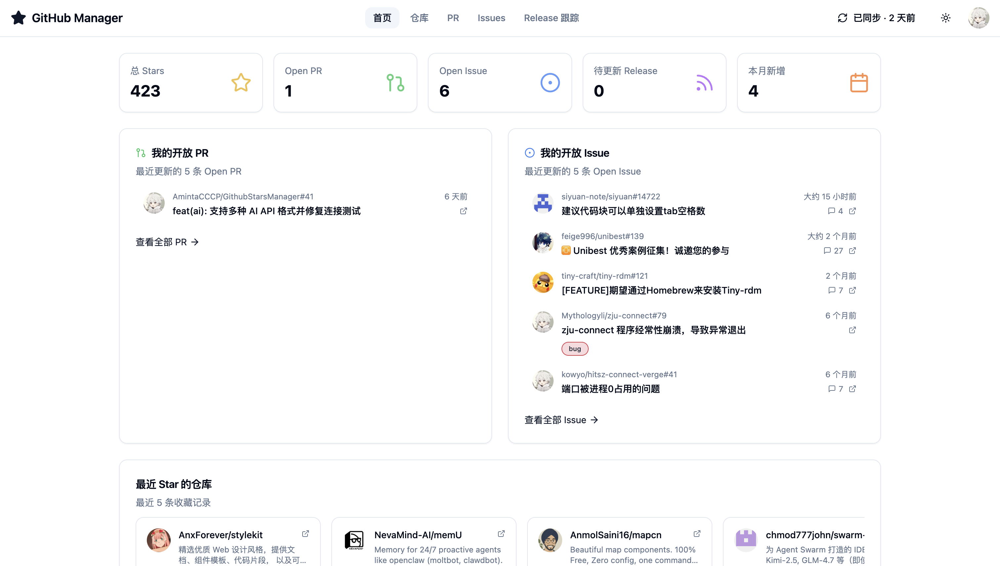
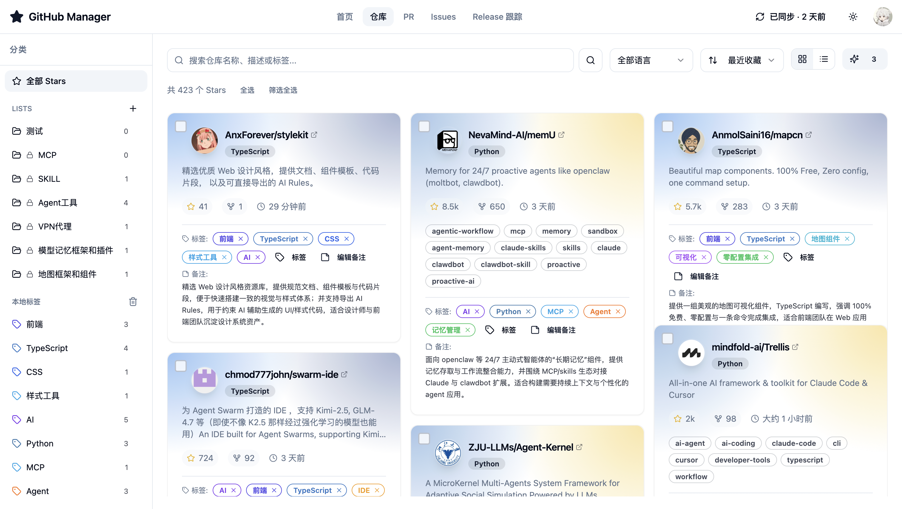
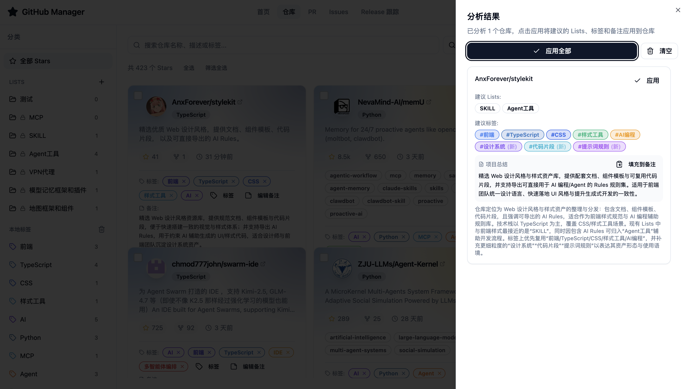
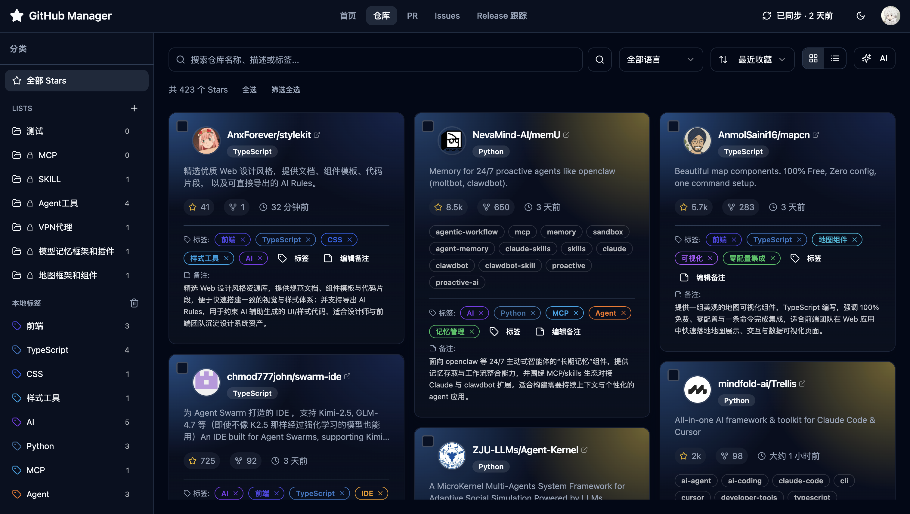

<div align="center">

**English** | [简体中文](./README.zh-CN.md)

# GitHub Manager

**All-in-one management for your GitHub Stars, Pull Requests, Issues & Release subscriptions**

Local Tags & Notes · Lists Sync · AI Analysis · Full Privacy Protection

[](https://react.dev)
[](https://typescriptlang.org)
[](https://vitejs.dev)
[](https://tailwindcss.com)
[](https://ui.shadcn.com)
[](./LICENSE)
[](https://github-manager-ten.vercel.app)

[Live Demo](https://github-manager-ten.vercel.app) · [Features](#features) · [Quick Start](#quick-start) · [Configuration](#configuration) · [FAQ](#faq)

</div>

---

## Features

<table>
<tr>
<td width="50%">

### Stars Management

Card/List dual views · Language filter · Multi-sort
Virtual scrolling for massive repos · Batch operations

</td>
<td width="50%">

### Local Tags & Notes

Custom colored tags · Personal notes
Data stored in browser, **fully private**

</td>
</tr>
<tr>
<td width="50%">

### GitHub Lists Integration

Seamless sync with GitHub native Lists
Organize by topic/purpose flexibly

</td>
<td width="50%">

### Release Subscriptions

Timeline view of version updates
Never miss important releases

</td>
</tr>
<tr>
<td width="50%">

### PR & Issues Hub

Centralized view of all your PR/Issues
Status filter · Full-text search

</td>
<td width="50%">

### AI Analysis <sup>Optional</sup>

Auto-categorization · Tag recommendations
Project summaries · Semantic search

</td>
</tr>
</table>

---

## Screenshots

<table>
<tr>
<td width="50%">

<p align="center"><b>Dashboard</b> - Overview & Quick Access</p>
</td>
<td width="50%">

<p align="center"><b>Stars Management</b> - Card View & Local Tags</p>
</td>
</tr>
<tr>
<td width="50%">

<p align="center"><b>AI Analysis</b> - Smart Categorization & Tags</p>
</td>
<td width="50%">

<p align="center"><b>Dark Mode</b> - Eye-friendly Theme</p>
</td>
</tr>
</table>

---

## Quick Start

### One-Click Deploy to Vercel

[](https://vercel.com/new/clone?repository-url=https://github.com/thornboo/github-manager)

> **Zero config, ready to use** — GitHub Token and AI Key are configured by users in the frontend UI, stored in browser localStorage.

### Local Development

```bash
# Install dependencies
pnpm install

# Frontend dev mode
pnpm dev
# → http://localhost:8081

# Full stack (with AI API)
npm i -g vercel && vercel dev
```

---

## Configuration

### GitHub Token

Go to [GitHub Settings → Tokens](https://github.com/settings/tokens) to create a Personal Access Token:

| Permission  | Purpose                           |
| ----------- | --------------------------------- |
| `read:user` | Read user profile                 |
| `repo`      | Access repos, Stars, GitHub Lists |

> **Privacy**: Token is stored only in browser `localStorage`. API requests go directly from browser to GitHub.

### AI Service <sup>Optional</sup>

Configure in app **Settings → AI Service**:

| Field    | Description                                                   |
| -------- | ------------------------------------------------------------- |
| Base URL | OpenAI-compatible endpoint, e.g., `https://api.openai.com/v1` |
| API Key  | Provider's secret key                                         |
| Model    | Model name, e.g., `gpt-4o`                                    |

Supports OpenAI, Azure OpenAI, and any OpenAI-compatible API providers.

---

## FAQ

<details>
<summary><b>Install error: ENOTFOUND registry.npmmirror.com</b></summary>

Switch to official registry:

```bash
pnpm config set registry https://registry.npmjs.org/
```

</details>

<details>
<summary><b>404 on sub-routes after deployment</b></summary>

Configure SPA fallback rules to redirect unmatched routes to `index.html`. Already configured in `vercel.json` for Vercel.

</details>

<details>
<summary><b>How to clear local data</b></summary>

Option 1: In-app **Settings → Clear Data**
Option 2: Browser DevTools → Application → Local Storage → Delete domain data

</details>

---

## Security

Uses **frontend-only trusted terminal model**:

- GitHub Token / AI Key stored only in browser localStorage
- GitHub API requests go directly from browser, not through backend
- AI requests forwarded via same-origin `/api/*` stateless proxy, no server-side key storage
- Supports `ALLOWED_ORIGINS` configuration for API call restrictions

> Use minimal permission tokens and only in trusted environments. For enterprise-grade security, consider evolving to BFF architecture.

---

## Tech Stack

| Frontend                | Backend               | Tooling                    |
| ----------------------- | --------------------- | -------------------------- |
| React 18 · TypeScript 5 | Vercel Serverless     | Vitest · ESLint · Prettier |
| Vite 5 · Tailwind CSS 3 | GitHub GraphQL API    | pnpm · PWA                 |
| shadcn/ui · Radix UI    | OpenAI-compatible API | React Query                |

---

## License

[MIT](./LICENSE) © 2026 thornboo
